# 校务管理系统

### 有问题，或者需要协助调试运行项目的, 可以加QQ：2529519551，或者微信 ：xzxj0206 注明项目，“git+项目名称” ，如：“git学生宿舍管理系统”

### 更多项目： https://github.com/34426?tab=repositories

## 一、介绍

### 基于springboot+mybatis+vue前后端分离的校务管理系统

## 二、系统运行界面

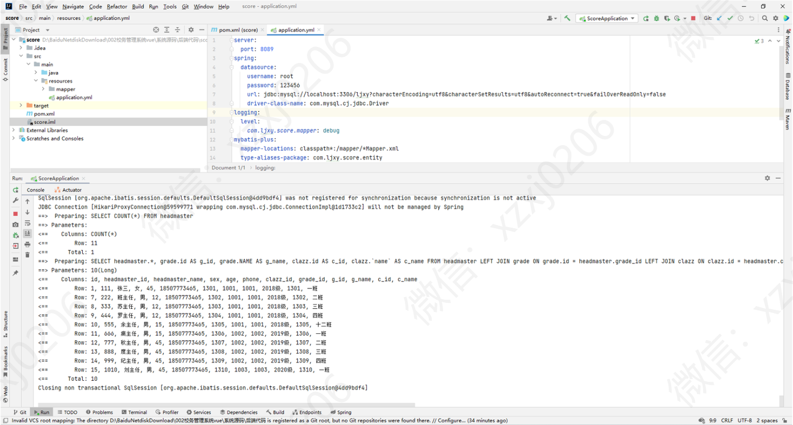

### 1、管理员功能模块部分页面展示

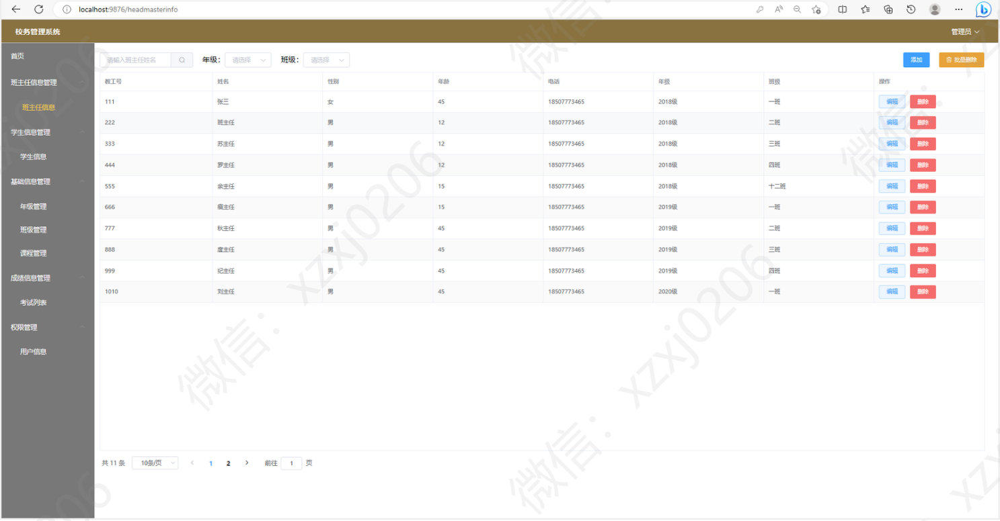

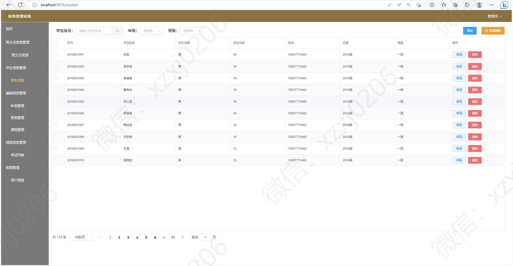

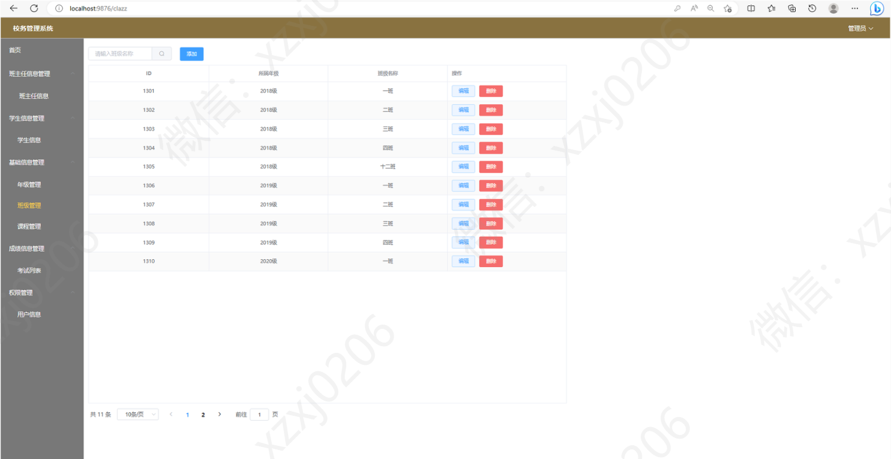

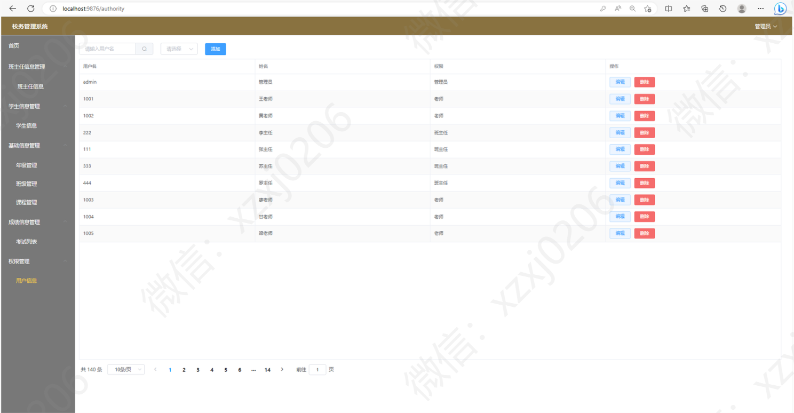

### 2、班主任功能模块部分页面展示

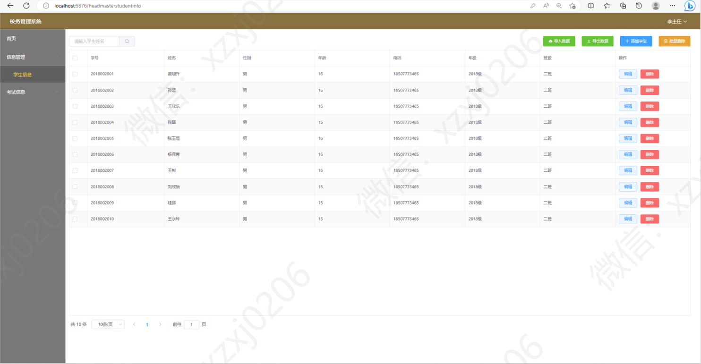

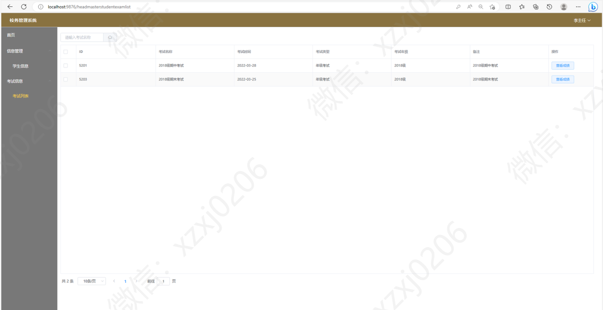

### 3、教师功能模块部分页面展示

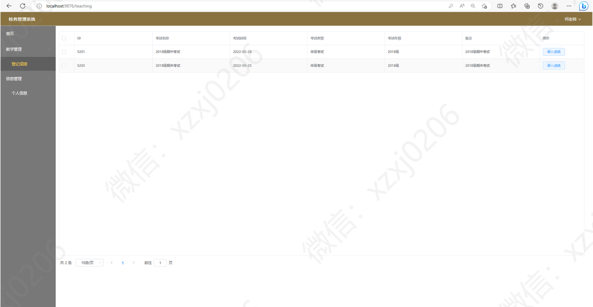

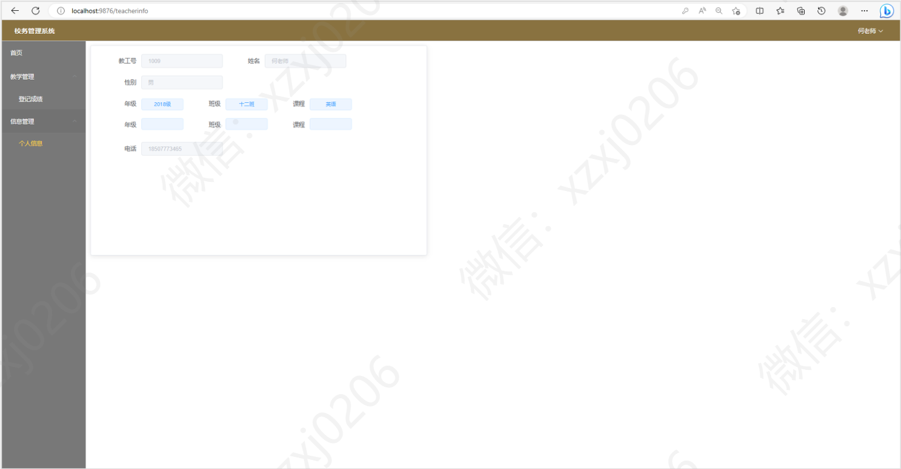

### 4、学生功能模块部分页面展示

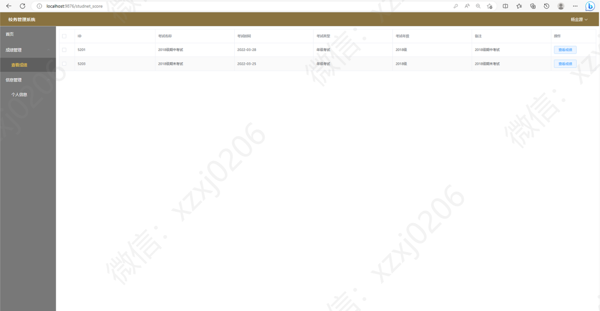

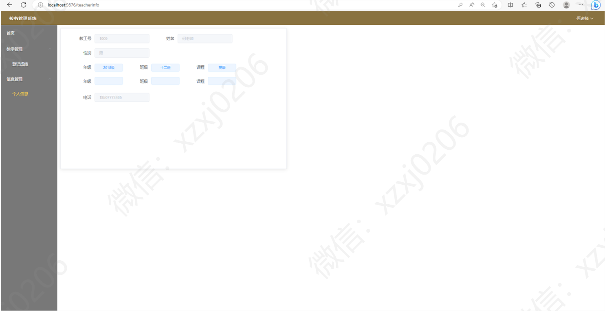
