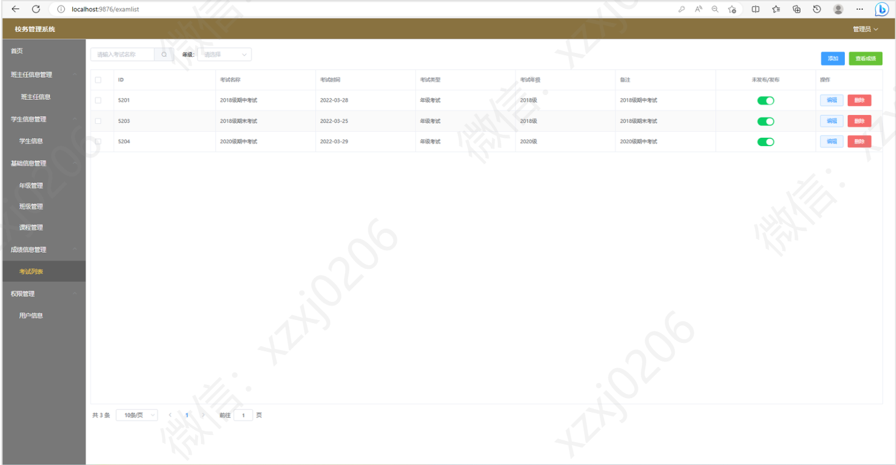

# 校务管理系统

### 9.9￥ 获取完整源码+sql，附赠万字论文，需要加Q：3577148218 ,备用Q: 3808981644
### 有问题，或者需要协助调试运行项目的也可联系
### 获取更多项目，关注公众号：编程项目集

## 项目介绍

### 基于springboot+mybatis+vue前后端分离的校务管理系统

语言：java

运行工具：idea或eclipse vscode 数据库：mysql

### 万字论文参考

### 1、管理员功能模块部分页面展示

### 2、班主任功能模块部分页面展示

### 3、教师功能模块部分页面展示

### 4、学生功能模块部分页面展示

